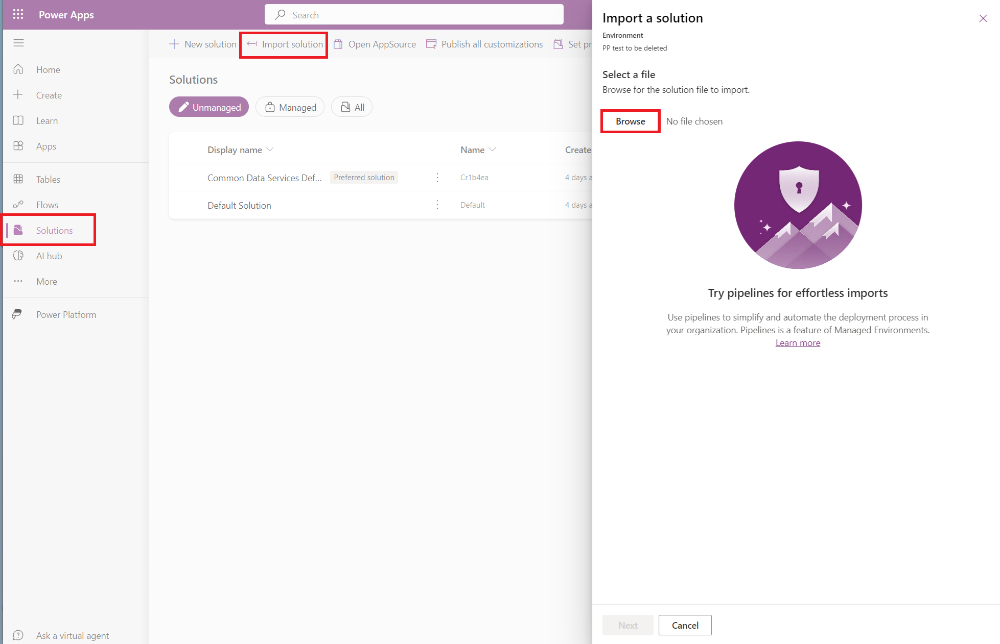
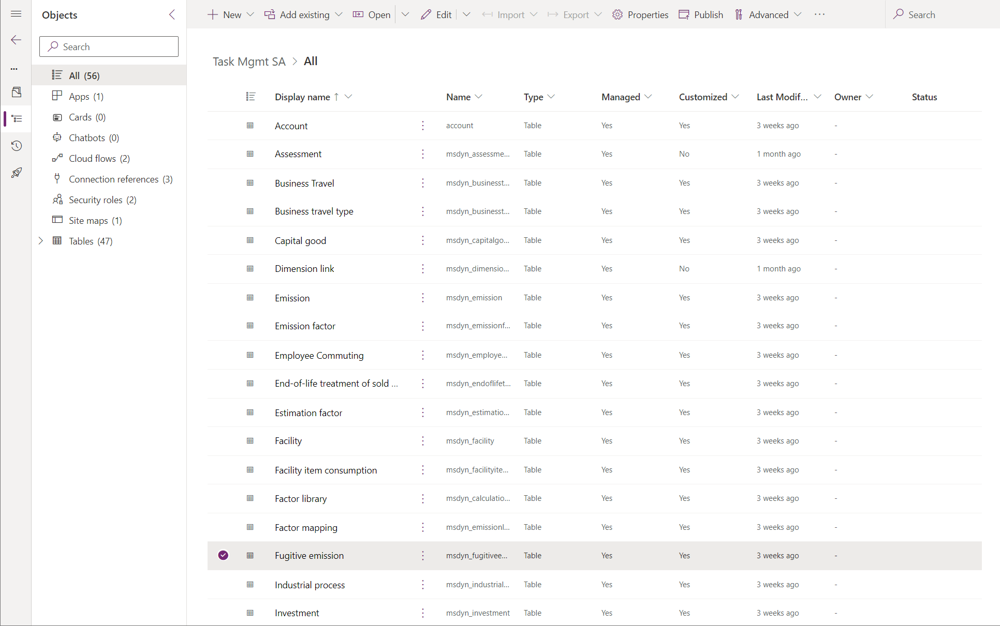

# Set up Task Management in Microsoft Sustainability Manager (MSM)
## Pre Requisites
1. Power Platform environment with System Administrator access.
2. Microsoft Sustainability Manager license.
3. Microsoft Sustainability Manager already deployed in the Power Platform environment from Step 1 (if MSM has not been deployed, please refer to the section below for step by step instructions on how to deploy MSM).
4. Download [TaskMgmtSolution.zip](./TaskMgmtSolution.zip) file from the `Deployment` folder.

## Deploy Microsoft Sustainability Manager
1. Go to Solution Center https://solutions.microsoft.com/.
2. Click on `Sustainability` from the left navigation menu.
3. Check `Add` on the Microsoft Sustainability Manager Premium Tile. 
4. Click `Deploy`.
5. Add `ESG Value Chain solution` component in MSM. We recommend also adding the sample data.
6. Select the Power Platform environment that was created for this deployment.
7. Give a name to the deployment and acknowledge terms.
8. Finish Deployment.
9. Please note it takes around 2-4 hours for MSM to get deployed.

## High level components that will be deployed from the Client solution.
This solution will include the below components -
1. Custom table for MSM Tasks
2. Power Automate flows for sending notifications in MS Teams and Outlook.
3. 2 security roles: Sustainability- Full Access- Task Analyst and Sustainability- Full Access- Task Manager. 
4. N:1 relationship between MSM tasks and various MSM tables.
5. Update to forms by having a subgrid for MSM Tasks in MSM Tables.

## Step 1: Import Power Platform Solution
Before setting up any components of the solution, we will need to import the solution in the Power Platform environment. 
1. In the PowerApps maker portal (make.powerapps.com), go to solutions > Import Solution > Browse > Choose Task Mgmt SA zip > Next

2. This will import the Power Platform solution in your environment. To validate everything got deployed, go to the imported solution and the number of components should be the same as below.

3. After the solution import, click 'Publish all customizations' from the navigation bar at the top.

### Step 2: Update the Power Automate workflows
This solution leverages 2 Power Automate workflows. Please make sure all of them are turned on. If any of them are turned off, click on the 3 ellipsis.

The Power Automate workflows have 1 URL component that will need to be updated so the flows can send a dynamic link of the task created to the user who got the assigned task. 

#### Step 2.1: Update URL in Power Automate
1. To update the URL in both the flows, we will need to navigate to MSM. 
2. In the PowerApps maker portal (make.powerapps.com), go to Apps> Click on Sustainability Manager > Click on 'MSM tasks'.
3. Create a new MSM task as a test by filling in the required fields and click 'Save'. You can delete this task afterwards if needed.
3. Copy the browser URL. It will look something like: https://xyz.crm.dynamics.com/main.aspx?appid=<app id guid value>&pagetype=entityrecord&etn=cra63_elastictask&id=<task GUID value>
4. Copy this browser URL TILL the task GUID value.Your copied value should end at the "=" before the task GUID value. Copied value should be "https://xyz.crm.dynamics.com/main.aspx?appid=<app id guid value>&pagetype=entityrecord&etn=cra63_elastictask&id=" from the example above.
5. Save the value from step 4.
6. Go to PowerApps Maker portal and click on Flows. Open the MSM Tasks Teams Notification flow.
7. In the compose action, replace the value saved from step 5 BEFORE the dynamic value of 'elastic task'. 

8. Click `Save`.
9. Repeat steps 6-8 for the MSM Tasks Email Notification flow.

