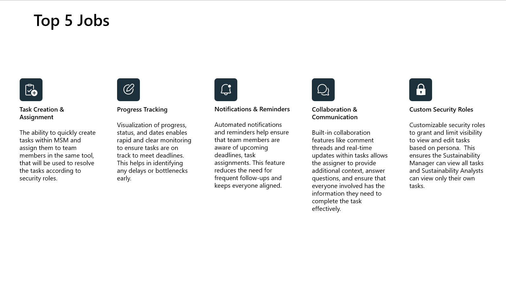

# Task Management in Microsoft Sustainability Manager (MSM) 

MENU: [**USER STORY**](#user-story) \| [**QUICK DEPLOY**](#quick-deploy) \| [**SUPPORTING DOCUMENTS**](#supporting-documents)

<h2 id="user-story">
 
User story
</h2>
**Solution Accelerator Overview**

This solution accelerator enhances the efficiency of Microsoft Sustainability Manager by adding the ability to effortlessly create, assign, manage, and track tasks. Following the same UI, UX and architecture of MSM, this accelerator introduces a task table having custom N:1 relationships with multiple MSM tables so users (Sustainability Managers, Analysts and other personas) can create, assign, track and manage tasks. The accelerator also has 2 custom security roles so managers can create & assign tasks throughout the organization whereas Analysts would be able to view, create & edit tasks assigned to them. Additionally, there will be notifications sent out in Microsoft Teams and Outlook upon task creation through Power Automate.

**Scenarios**

As a Sustainability Manager or Sustainability Analyst, you will be able to deploy this accelerator on top of your existing MSM environment. This will allow you to
 1. Create, manage, track, and assign tasks as a Sustainability Manager specific to MSM tables like Emissions, Scope 1, Scope 2 and Scope 3 activity tables, Accounts etc. You can create generic tasks for data validation, data import, etc. This also allows you to get a 360 view of all scheduled, completed and in-progress tasks to help you to prioritize, delegate, and track progress.
 2. As a Analyst, you will receive notifications when a task is assigned to the user. There will be custom views to track & manage tasks assigned to the logged in user. 
 

**Key Features** 

Below diagram illustrates the key features of this solution accelerator:

**Solution Accelerator Landing Page**

Below is a sample landing page of the solution accelerator after it is deployed, set up, and ready to be used.

<h2 id="quick-deploy">
 
Quick deploy
</h2>

Please click this [**Link to Deployment Guide**](./Deployment/README.md) for instructions on how to deploy and set up the solution accelerator. 

### Solution Accelerator Architecture

Below diagram depicts the architecture of this solution accelerator. 

<h2 id="supporting-documents">
 
Supporting Documents
</h2>
Please refer to following additional documentation along with [Microsoft Sustainability Manager](https://learn.microsoft.com/en-us/industry/sustainability/sustainability-manager-overview)

1. [Microsoft Teams](https://learn.microsoft.com/en-us/microsoftteams/)
2. [Official Microsoft Power Automate](https://learn.microsoft.com/en-us/power-automate/)
3. [Power Apps model-driven apps](https://learn.microsoft.com/en-us/power-apps/maker/model-driven-apps/)
4. [Dataverse](https://learn.microsoft.com/en-us/power-apps/maker/data-platform/)

## Disclaimers

This release only supports English language input and output. Users should not attempt to use the system with any other language or format. The system output may not be compatible with any translation tools or services, and may lose its meaning or coherence if translated. 

This release does not reflect the opinions, views, or values of Microsoft Corporation or any of its affiliates, subsidiaries, or partners. The system output is solely based on the system's own logic and algorithms, and does not represent any endorsement, recommendation, or advice from Microsoft or any other entity. Microsoft disclaims any liability or responsibility for any damages, losses, or harms arising from the use of this release or its output by any user or third party. 

This release does not provide any financial advice, and is not designed to replace the role of qualified client advisors in appropriately advising clients. Users should not use the system output for any financial decisions or transactions, and should consult with a professional financial advisor before taking any action based on the system output. Microsoft is not a financial institution or a fiduciary, and does not offer any financial products or services through this release or its output. 

This release is intended as a proof of concept only, and is not a finished or polished product. It is not intended for commercial use or distribution, and is subject to change or discontinuation without notice. Any planned deployment of this release or its output should include comprehensive testing and evaluation to ensure it is fit for purpose and meets the user's requirements and expectations. Microsoft does not guarantee the quality, performance, reliability, or availability of this release or its output, and does not provide any warranty or support for it. 

This Software requires the use of third-party components which are governed by separate proprietary or open-source licenses as identified below, and you must comply with the terms of each applicable license in order to use the Software. You acknowledge and agree that this license does not grant you a license or other right to use any such third-party proprietary or open-source components.  

To the extent that the Software includes components or code used in or derived from Microsoft products or services, including without limitation Microsoft Azure Services (collectively, “Microsoft Products and Services”), you must also comply with the Product Terms applicable to such Microsoft Products and Services. You acknowledge and agree that the license governing the Software does not grant you a license or other right to use Microsoft Products and Services. Nothing in the license or this ReadMe file will serve to supersede, amend, terminate or modify any terms in the Product Terms for any Microsoft Products and Services. 

You must also comply with all domestic and international export laws and regulations that apply to the Software, which include restrictions on destinations, end users, and end use. For further information on export restrictions, visit https://aka.ms/exporting. 

You acknowledge that the Software and Microsoft Products and Services (1) are not designed, intended or made available as a medical device(s), and (2) are not designed or intended to be a substitute for professional medical advice, diagnosis, treatment, or judgment and should not be used to replace or as a substitute for professional medical advice, diagnosis, treatment, or judgment. Customer is solely responsible for displaying and/or obtaining appropriate consents, warnings, disclaimers, and acknowledgements to end users of Customer’s implementation of the Online Services. 

You acknowledge the Software is not subject to SOC 1 and SOC 2 compliance audits. No Microsoft technology, nor any of its component technologies, including the Software, is intended or made available as a substitute for the professional advice, opinion, or judgement of a certified financial services professional. Do not use the Software to replace, substitute, or provide professional financial advice or judgment.  

BY ACCESSING OR USING THE SOFTWARE, YOU ACKNOWLEDGE THAT THE SOFTWARE IS NOT DESIGNED OR INTENDED TO SUPPORT ANY USE IN WHICH A SERVICE INTERRUPTION, DEFECT, ERROR, OR OTHER FAILURE OF THE SOFTWARE COULD RESULT IN THE DEATH OR SERIOUS BODILY INJURY OF ANY PERSON OR IN PHYSICAL OR ENVIRONMENTAL DAMAGE (COLLECTIVELY, “HIGH-RISK USE”), AND THAT YOU WILL ENSURE THAT, IN THE EVENT OF ANY INTERRUPTION, DEFECT, ERROR, OR OTHER FAILURE OF THE SOFTWARE, THE SAFETY OF PEOPLE, PROPERTY, AND THE ENVIRONMENT ARE NOT REDUCED BELOW A LEVEL THAT IS REASONABLY, APPROPRIATE, AND LEGAL, WHETHER IN GENERAL OR IN A SPECIFIC INDUSTRY. BY ACCESSING THE SOFTWARE, YOU FURTHER ACKNOWLEDGE THAT YOUR HIGH-RISK USE OF THE SOFTWARE IS AT YOUR OWN RISK.  

