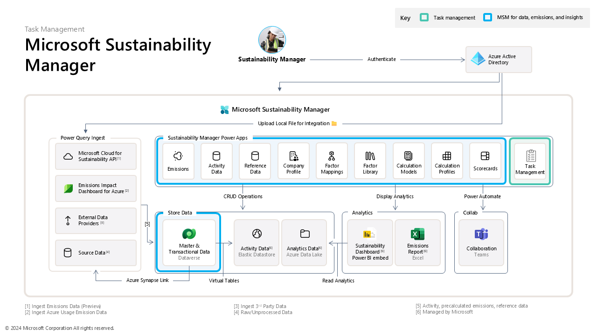

# Task Management in Microsoft Sustainability Manager (MSM) 

The Task Management in Microsoft Sustainability Manager (MSM) accelerator enhances MSM by enabling users to manage tasks within a single interface. This accelerator facilitates task creation, assignment, collaboration, and resolution, improving productivity and visibility, and ensuring timely completion of sustainability-related tasks.

 

  
[**SOLUTION OVERVIEW**](#solution-overview)  \| [**QUICK DEPLOY**](#quick-deploy)  \| [**BUSINESS USE CASE**](#business-use-case)  \| [**SUPPORTING DOCUMENTATION**](#supporting-documentation)

 

<h2>
Solution overview
</h2>

This solution accelerator enhances the efficiency of Microsoft Sustainability Manager by adding the ability to effortlessly create, assign, manage, and track tasks. Following the same UI, UX and architecture of MSM, this accelerator introduces a task table having custom N:1 relationships with multiple MSM tables so users (Sustainability Managers, Analysts and other personas) can create, assign, track and manage tasks. The accelerator also has 2 custom security roles so managers can create & assign tasks throughout the organization whereas Analysts would be able to view, create & edit tasks assigned to them. Additionally, there will be notifications sent out in Microsoft Teams and Outlook upon task creation through Power Automate.

### Solution architecture

Below diagram depicts the architecture of this solution accelerator. 

### How to customize

This solution is designed to be easily customizable. All configuration and customizations to this solution will be done in Power Platform. 

**There is opportunities for extension/modifications to**

1) Custom tables of the solution
2) Cloud flow that sends notifications
3) Notifications template for Teams channel and email.  
4) Extend N:1 relations from MSM task table to other tables in MSM which is not covered in the solution.

 

### Additional resources

This accelerator focuses on harnessing the following key capabilities:

* [Configure tables in Dataverse](https://learn.microsoft.com/en-us/training/modules/get-started-with-powerapps-common-data-service/)
* [Create a Cloud flow in power automate](https://learn.microsoft.com/en-us/power-automate/get-started-logic-flow?tabs=new-designer)
* [Building model driven app using in power apps](https://learn.microsoft.com/en-us/power-apps/maker/model-driven-apps/)

 

### Key features

  
Click to learn more about the key features this solution enables

  - **Task Creation and assignment**  
  The ability to quickly create tasks, related to the use of MSM, and assign them to team members in the same tool, MSM, that will be used to resolve the tasks according to security roles.  
    
  - **Progress tracking**  
  Visualization of progress, status, and dates enables rapid and clear monitoring to ensure tasks are on track to meet deadlines. This helps in identifying any delays or bottlenecks early.
  
  - **Notifications and reminders**  
  Automated notifications help ensure that team members are aware of upcoming deadlines, task assignments. This feature reduces the need for frequent follow-ups and keeps everyone aligned.
  
  - **Custom security roles**  
  Customizable security roles to grant and limit visibility to view and edit tasks based on persona.  This ensures the Sustainability Manager can view all tasks and Sustainability Analysts can view only their own tasks. 
  
  - **Collaboration and communication**  
  Built-in collaboration with comments and real-time updates within tasks allows the assigner to provide additional context, answer questions, and ensure that everyone involved has the information they need to complete the tasks effectively.
    

  
<h2>
Quick deploy
</h2>

### How to install or deploy
Please click this [**Link to Deployment Guide**](./Deployment/README.md) for instructions on how to deploy and set up the solution accelerator. 

 

### Prerequisites and Costs

Apart from having a [Power platform license] (https://learn.microsoft.com/en-us/power-platform/admin/pricing-billing-skus), to deploy this solution accelerator, ensure you have access to [Microsot sustainability manager] (https://www.microsoft.com/en-us/sustainability/microsoft-sustainability-manager) with the necessary permissions to the features.

Check the [International availability of Microsoft Cloud for sustainability](https://learn.microsoft.com/en-us/industry/sustainability/availability) page and select a **region** where the services are available.

 

| Product | Description | Cost |
|---|---|---|
| [Microsoft sustainability manager](https://www.microsoft.com/en-us/sustainability/microsoft-sustainability-manager) | Decription of how the product is used | [Pricing](https://www.microsoft.com/en-us/sustainability/microsoft-sustainability-manager#Pricing) |
| [Microsoft power platform](https://learn.microsoft.com/en-us/power-platform/admin/pricing-billing-skus) | Decription of how the product is used | [Pricing](https://www.microsoft.com/en-us/power-platform/pricing/) |

 

  
<h2>
Business Use Case
</h2>

Below is a sample landing page of the solution accelerator after it is deployed, set up, and ready to be used.

As a Sustainability Manager or Sustainability Analyst, you will be able to deploy this accelerator on top of your existing MSM environment. This will allow you to
 1. Create, manage, track, and assign tasks as a Sustainability Manager specific to MSM tables like Emissions, Scope 1, Scope 2 and Scope 3 activity tables, Accounts etc. You can create generic tasks for data validation, data import, etc. This also allows you to get a 360 view of all scheduled, completed and in-progress tasks to help you to prioritize, delegate, and track progress.
 2. As a Analyst, you will receive notifications when a task is assigned to the user. There will be custom views to track & manage tasks assigned to the logged in user. 

### Business value - Added new

  
Click to learn more about what value this solution provides

  - **Increased productivity**  
  A single solution saves time switching between tools and makes it easier to manage and track tasks.

  - **Clearer visibility**  
  A single solution provides a clear overview of all tasks, making it secure, easier to prioritize, and monitor progress
     
  - **Improved engagement**  
  Processes are simplified because employees need only go to one place to manage tasks.

  - **Enhanced collaboration**  
  Unified tool allows everyone to work from the same platform, reducing communication gaps for better alignment 
       

  
<h2>
Supporting documentation
</h2>

Please refer to following additional documentation along with [Microsoft Sustainability Manager(MSM)](https://learn.microsoft.com/en-us/industry/sustainability/sustainability-manager-overview):

1. [Microsoft Teams](https://learn.microsoft.com/en-us/microsoftteams/) 
2. [Microsoft Power Automate](https://learn.microsoft.com/en-us/power-automate/) 
3. [Model Driven Apps in Power Apps](https://learn.microsoft.com/en-us/power-apps/maker/model-driven-apps)
4. [Microsoft Dataverse](https://learn.microsoft.com/en-us/power-apps/maker/data-platform/)

### Security guidelines

For the solution there are two custom security roles created. Please adhere to the power platform's [Security roles and priviledges](https://learn.microsoft.com/en-us/power-platform/admin/security-roles-privileges?tabs=new) to control access to the solution functionalities. 

 

 

### Cross references
Check out similar solution accelerators
 
| Solution Accelerator | Description |
|---|---|
| [Comparative analysis](https://github.com/microsoft/Comparative-Analysis-for-Sustainability-Solution-Accelerator/) | This solution accelerator enables companies to detect compliance gaps, benchmark against their peers, and generate action plans to ensure they’re on track to meet their sustainability goals.|

    

## Provide feedback

Have questions, find a bug, or want to request a feature? [Submit a new issue](https://github.com/microsoft/Comparative-Analysis-for-Sustainability-Solution-Accelerator/issues/new/choose) on this repo and we'll connect.

 

## Responsible AI Transparency FAQ
Please refer to [Transparency FAQ](./TRANSPARENCY_FAQ.md) for responsible AI transparency details of this solution accelerator.

 

## Disclaimers

To the extent that the Software includes components or code used in or derived from Microsoft products or services, including without limitation Microsoft Azure Services (collectively, “Microsoft Products and Services”), you must also comply with the Product Terms applicable to such Microsoft Products and Services. You acknowledge and agree that the license governing the Software does not grant you a license or other right to use Microsoft Products and Services. Nothing in the license or this ReadMe file will serve to supersede, amend, terminate or modify any terms in the Product Terms for any Microsoft Products and Services. 

You must also comply with all domestic and international export laws and regulations that apply to the Software, which include restrictions on destinations, end users, and end use. For further information on export restrictions, visit https://aka.ms/exporting. 

You acknowledge that the Software and Microsoft Products and Services (1) are not designed, intended or made available as a medical device(s), and (2) are not designed or intended to be a substitute for professional medical advice, diagnosis, treatment, or judgment and should not be used to replace or as a substitute for professional medical advice, diagnosis, treatment, or judgment. Customer is solely responsible for displaying and/or obtaining appropriate consents, warnings, disclaimers, and acknowledgements to end users of Customer’s implementation of the Online Services. 

You acknowledge the Software is not subject to SOC 1 and SOC 2 compliance audits. No Microsoft technology, nor any of its component technologies, including the Software, is intended or made available as a substitute for the professional advice, opinion, or judgement of a certified financial services professional. Do not use the Software to replace, substitute, or provide professional financial advice or judgment.  

BY ACCESSING OR USING THE SOFTWARE, YOU ACKNOWLEDGE THAT THE SOFTWARE IS NOT DESIGNED OR INTENDED TO SUPPORT ANY USE IN WHICH A SERVICE INTERRUPTION, DEFECT, ERROR, OR OTHER FAILURE OF THE SOFTWARE COULD RESULT IN THE DEATH OR SERIOUS BODILY INJURY OF ANY PERSON OR IN PHYSICAL OR ENVIRONMENTAL DAMAGE (COLLECTIVELY, “HIGH-RISK USE”), AND THAT YOU WILL ENSURE THAT, IN THE EVENT OF ANY INTERRUPTION, DEFECT, ERROR, OR OTHER FAILURE OF THE SOFTWARE, THE SAFETY OF PEOPLE, PROPERTY, AND THE ENVIRONMENT ARE NOT REDUCED BELOW A LEVEL THAT IS REASONABLY, APPROPRIATE, AND LEGAL, WHETHER IN GENERAL OR IN A SPECIFIC INDUSTRY. BY ACCESSING THE SOFTWARE, YOU FURTHER ACKNOWLEDGE THAT YOUR HIGH-RISK USE OF THE SOFTWARE IS AT YOUR OWN RISK. 